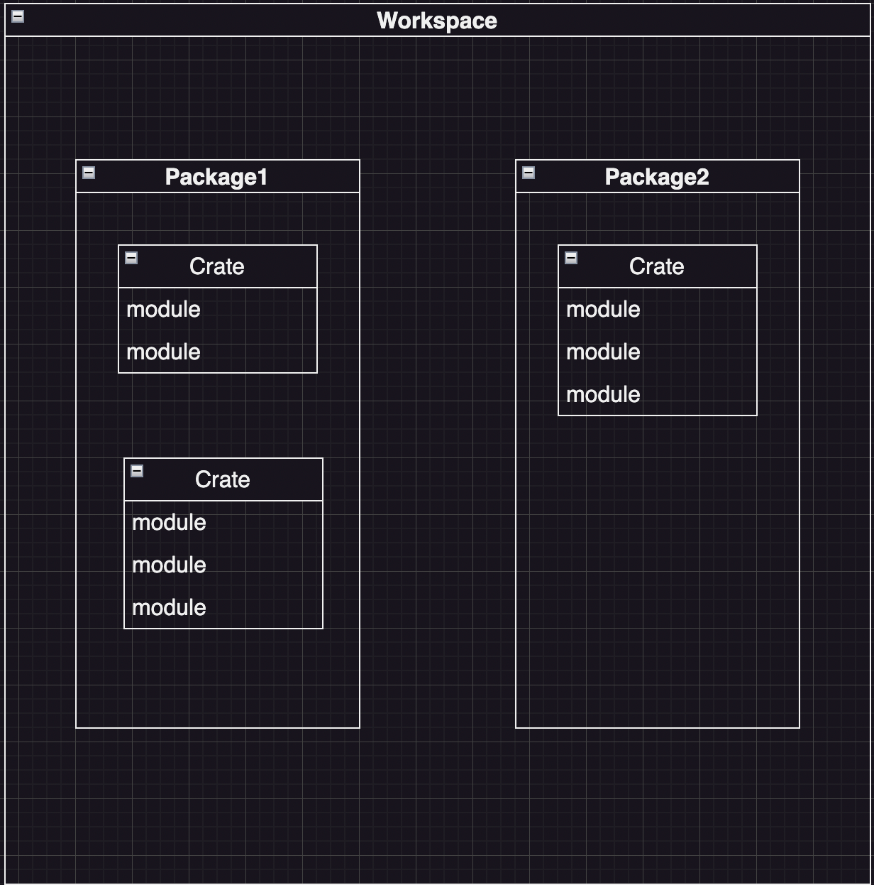

**クレート** ... 1つのRustプログラム。いくつかのモジュールから構成され，コンパイルすると実行可能ファイルか，ライブラリが構成される。

**パッケージ** ... Cargoの1単位。複数のクレート(具体的には，1つのlibクレートと複数のbinクレート), その他，テストやexampleなどのクレートを持つことができる

**ワークスペース** ... 複数のパッケージで構成されるプロジェクト。

**プロジェクト** ... Cargoにおける最大単位。ワークスペースとして複数パッケージをまとめていることもあれば，単一のパッケージのプロジェクトでもありうる

cargo run で 実行可能ファイルに引数を渡すには -- を使う。
`cargo run -- test/test/txt`

Cargoはデフォルトでlib.rsをlibクレートのエントリーポイント，main.rsまたはbin/したのファイルをbinクレートのエントリポイントとして認識する